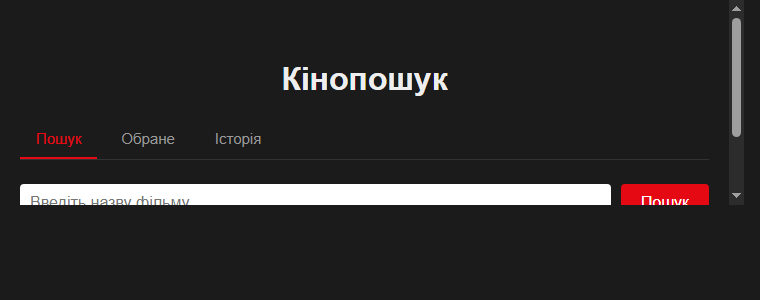
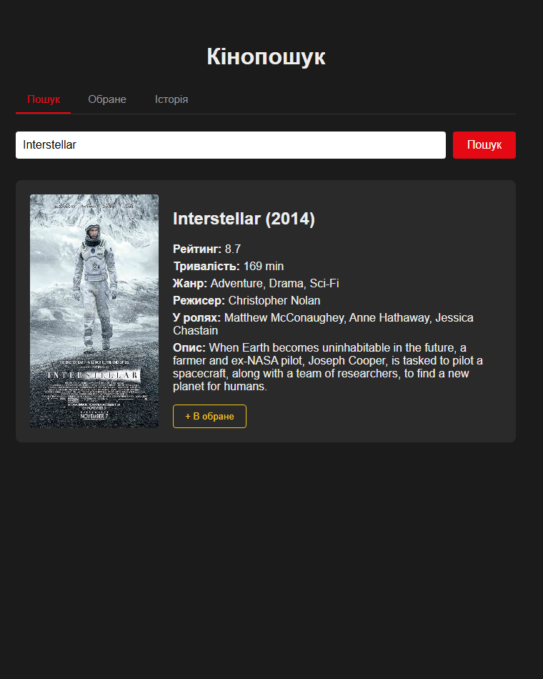
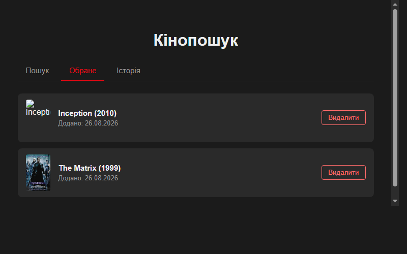
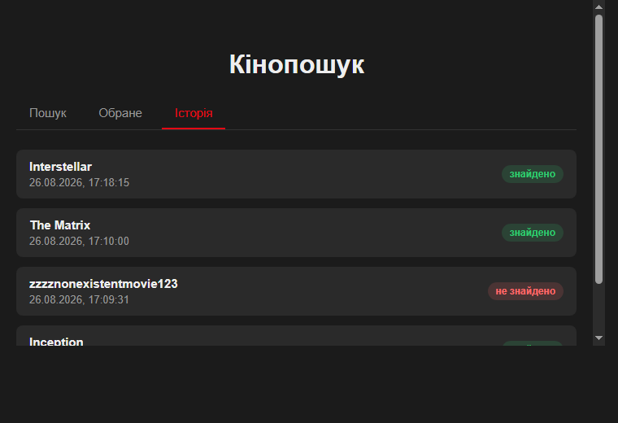

# Кінопошук

Веб-додаток на ASP.NET Core (.NET 9) для пошуку інформації про фільми через
[OMDb API](https://www.omdbapi.com), зі збереженням "Обраного" та історії
пошуку в SQL Server. Побудований за Clean Architecture (Presentation /
Application / Domain / Infrastructure / SharedKernel).

## Документація курсового проєкту

- [TEAM.md](TEAM.md) — команда, ролі
- [SRS.md](SRS.md) — Software Requirements Specification (v2.0)
- [docs/architecture/ARCHITECTURE.md](docs/architecture/ARCHITECTURE.md) —
  архітектура системи, структура бекенду/фронтенду/БД, UML-діаграма класів
  з обґрунтуванням, архітектурні паттерни (тиждень 2)
- [docs/architecture/class-diagram.md](docs/architecture/class-diagram.md) —
  повна UML-діаграма класів

## Функціонал

- **Пошук** фільму за назвою через OMDb API
- **Обране** — додавання/перегляд/видалення фільмів (SQL Server)
- **Історія** — автоматичний лог усіх пошукових запитів

## Скріншоти роботи додатку









## Запуск

Потрібен SQL Server LocalDB. Рядок підключення в `appsettings.json`
(`ConnectionStrings:KinoPoshukDb`) — база та таблиці створюються
автоматично при першому запуску.

```bash
dotnet run
```

Застосунок доступний на порту, вказаному в `Properties/launchSettings.json`.

## Структура

- `Controllers/` — Presentation: HTTP-ендпоінти
- `Middleware/` — обробка помилок та логування запитів
- `Application/` — сервіси, DTO, мапери
- `Domain/` — сутності та контракти репозиторіїв
- `Infrastructure/` — EF Core (`KinoPoshukDbContext`), репозиторії, клієнт OMDb API
- `SharedKernel/` — винятки, константи, розширення
- `wwwroot/` — фронтенд (Пошук / Обране / Історія)
