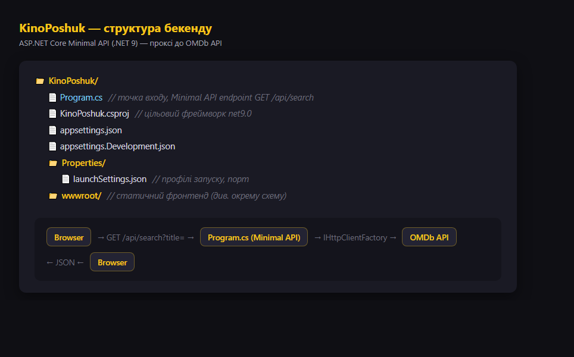
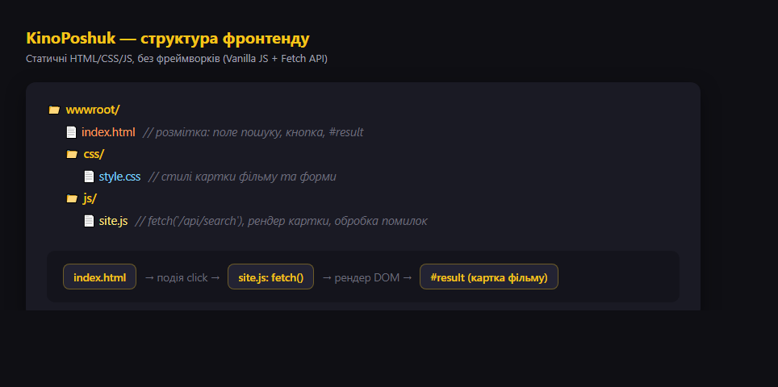
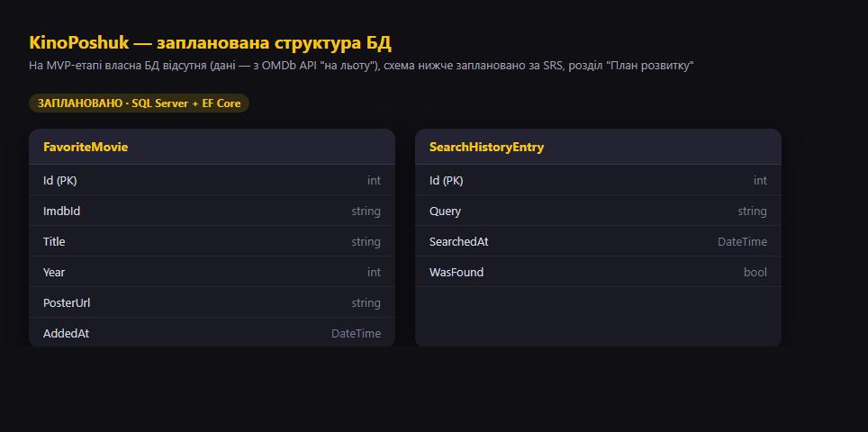

# Архітектура системи — KinoPoshuk

Тиждень 2 (24.08–30.08): проєктування архітектури з урахуванням
[SRS](../../SRS.md).

## 1. Структура проєкту (скріни)

### Бекенд

ASP.NET Core Minimal API (.NET 9), єдиний ендпоінт-проксі до OMDb API.



### Фронтенд

Статичні HTML/CSS/JS без фреймворків, `fetch` до `/api/search`.



### База даних

На MVP-етапі власної БД немає — дані читаються з OMDb API напряму. Нижче —
запланована схема (SQL Server + EF Core) для наступної ітерації, описаної в
SRS ("План розвитку"): збереження обраних фільмів та історії пошуку.



## 2. UML-діаграма класів

Основні сутності та зв'язки між ними — див. [class-diagram.md](class-diagram.md)
(Mermaid-діаграма, рендериться нативно на GitHub).

## 3. Архітектурні та проєктні паттерни

| Паттерн | Де застосовано | Навіщо |
|---|---|---|
| **Adapter / Facade** | `OmdbClient` реалізує `IOmdbClient` | Ізолює формат відповіді стороннього OMDb API від решти застосунку — якщо OMDb змінить формат або його замінить інше джерело даних, зміниться лише один клас |
| **Dependency Injection** | `IOmdbClient` реєструється в DI-контейнері ASP.NET Core, інжектиться в `MovieSearchService` | Слабка зв'язаність, можливість підміни реалізації в тестах |
| **DTO (Data Transfer Object)** | `MovieDto` | Явний типізований контракт між бекендом і фронтендом замість "сирого" JSON |
| **Repository (заплановано)** | `AppDbContext` як точка доступу до `FavoriteMovie` / `SearchHistoryEntry` | Коли з'явиться власна БД — інкапсуляція запитів до даних окремо від бізнес-логіки сервісу пошуку |
| **Layered architecture** | Program.cs (маршрутизація) → Service (бізнес-логіка) → Client (зовнішнє API) | Розділення відповідальностей: HTTP-шар не знає деталей звернення до OMDb |

## 4. Потік даних (поточний MVP)

```
Browser (index.html + site.js)
   │  fetch GET /api/search?title=...
   ▼
Program.cs — Minimal API endpoint
   │  делегує
   ▼
MovieSearchService (заплановане виділення сервісного шару)
   │  IOmdbClient.GetByTitleAsync(title)
   ▼
OmdbClient — HttpClient → http://www.omdbapi.com
   │  JSON відповідь
   ▼
MovieDto → назад у Program.cs → JSON → Browser
```
