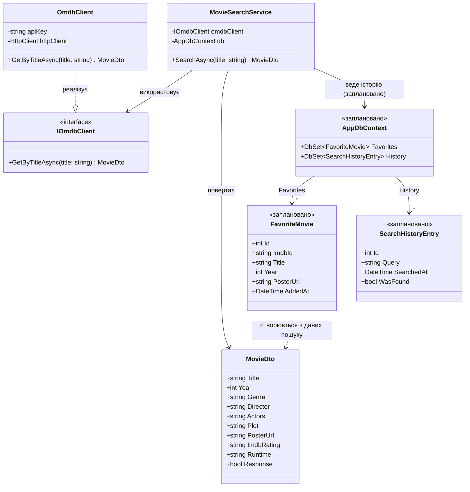

# UML-діаграма класів — KinoPoshuk

Діаграма описує основні сутності поточної (MVP) та запланованої (наступна
ітерація за [SRS](../../SRS.md), розділ 9 "План розвитку") архітектури:
сервіс пошуку, клієнт зовнішнього OMDb API, DTO фільму та заплановані
сутності бази даних (обрані фільми, історія пошуку).

## Пояснення зв'язків

- **`MovieSearchService` → `IOmdbClient`** — сервіс пошуку залежить від
  абстракції клієнта зовнішнього API, а не від конкретної реалізації
  (Dependency Inversion)
- **`OmdbClient` реалізує `IOmdbClient`** — конкретна реалізація на базі
  `HttpClient`, інкапсулює формування URL та API-ключ OMDb
- **`MovieSearchService` → `MovieDto`** — результат пошуку повертається як
  типізований DTO, а не сирий JSON
- **`AppDbContext` 1 → * `FavoriteMovie` / `SearchHistoryEntry`** —
  заплановані сутності для збереження обраних фільмів та історії пошуків
  (наступна ітерація, потребує SQL Server + EF Core)
