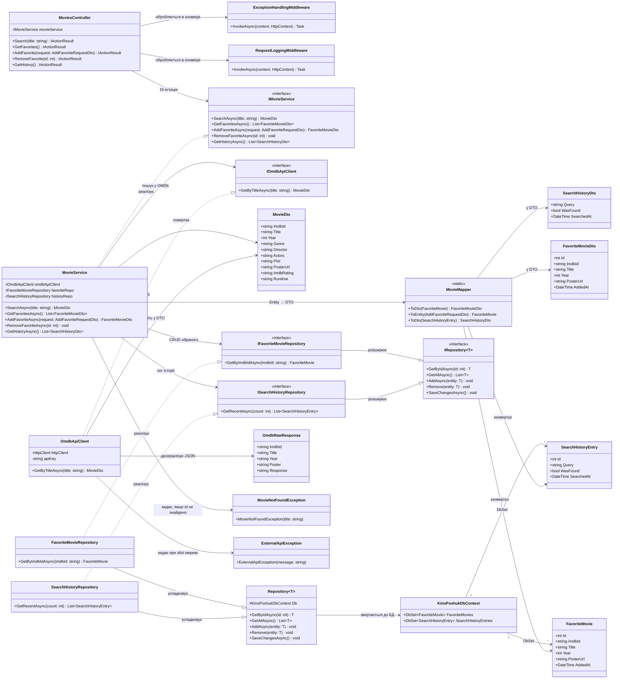

# UML-діаграма класів — KinoPoshuk

Діаграма описує **реально реалізовані** класи проєкту (не ескіз "на майбутнє") —
відповідає фактичній структурі коду після переходу на Clean Architecture
(див. [ARCHITECTURE.md](ARCHITECTURE.md), [структуру бекенду](structure-backend.png)).
Кожен клас і кожен зв'язок нижче explicitно обґрунтовано — чому він існує і
яку проблему вирішує.

## Обґрунтування кожного шару та зв'язку

### Чому саме такий поділ на класи (а не один "товстий" контролер)?

У вихідній версії проєкту (тиждень 1) увесь код містився в одному
`Program.cs` — HTTP-роутинг, звернення до OMDb і формування відповіді були
перемішані в одній лямбді. Це не масштабується: щойно з'являється друга
функція (обране, історія — вимога курсового проєкту "буде більше
елементів"), такий підхід перетворюється на нечитабельний файл. Тому код
розділено на **4 шари за принципом Clean Architecture** — кожен наступний
пункт пояснює, навіщо конкретно цей шар потрібен.

### Presentation (`MoviesController`, `Middleware/`)

`MoviesController` **не містить бізнес-логіки** — лише приймає HTTP-запит,
викликає `IMovieService` і повертає результат. Обґрунтування: якщо завтра
з'явиться, наприклад, Blazor-клієнт або мобільний застосунок, він зможе
використати той самий `IMovieService`, не чіпаючи HTTP-шар.

`ExceptionHandlingMiddleware` централізує обробку помилок (замість
try/catch у кожному методі контролера) — ловить `MovieNotFoundException` і
`ExternalApiException` і перетворює їх на коректні HTTP-статуси (404, 502).
`RequestLoggingMiddleware` логує кожен запит окремо від бізнес-логіки —
класичний приклад **cross-cutting concern**, який належить саме
middleware-конвеєру, а не сервісу.

### Application (`IMovieService`/`MovieService`, DTO, `MovieMapper`)

`MovieService` — єдине місце, де описано *сценарії використання*: "пошук
фільму одночасно записує запит в історію", "додавання в обране перевіряє
дублікати за `ImdbId`". Це бізнес-правила проєкту, а не деталі HTTP чи БД,
тому вони не в контролері й не в репозиторії.

`IMovieService` — інтерфейс, а не тільки клас `MovieService`, щоб
`MoviesController` залежав від **абстракції**, а не від конкретної
реалізації (Dependency Inversion) — це дозволяє підмінити сервіс
mock-об'єктом у тестах без запуску реальної БД чи OMDb API.

`MovieDto`/`FavoriteMovieDto`/`SearchHistoryDto` — окремі DTO для кожного
напрямку даних, а не "одна модель на все", бо, наприклад, `FavoriteMovieDto`
має поле `AddedAt`, якого немає в результаті пошуку `MovieDto`. Змішування
цих моделей ускладнило б і серіалізацію, і читання коду.

`MovieMapper` виносить перетворення Entity ↔ DTO в один клас, щоб ця логіка
не дублювалася в `MovieService` — типова причина для мапера в
багатошаровій архітектурі.

### Domain (`FavoriteMovie`, `SearchHistoryEntry`, `IRepository<T>` та похідні)

Сутності `FavoriteMovie` і `SearchHistoryEntry` — це моделі, що описують
предметну область (яка інформація про фільм зберігається постійно), і **не
залежать від EF Core чи ASP.NET Core** — Domain-шар не має посилань на
жоден інший шар проєкту, це навмисне архітектурне рішення: доменна логіка
має лишатися незмінною, навіть якщо змінити ORM або фреймворк.

`IRepository<T>` — узагальнений контракт (`GetByIdAsync`, `AddAsync`,
`Remove`, `SaveChangesAsync`), спільний для всіх сутностей. `
IFavoriteMovieRepository`/`ISearchHistoryRepository` розширюють його
власними методами (`GetByImdbIdAsync`, `GetRecentAsync`), які специфічні
лише для конкретної сутності — так уникнули дублювання спільних CRUD-методів
і водночас не обмежили репозиторії лише узагальненим інтерфейсом.

### Infrastructure (`KinoPoshukDbContext`, `Repository<T>` та похідні, `OmdbApiClient`)

`Repository<T>` — **єдина** реалізація базових CRUD-операцій через EF Core;
`FavoriteMovieRepository`/`SearchHistoryRepository` успадковують її й
додають лише свою специфіку. Якби кожен репозиторій писав `DbSet.FindAsync`,
`DbSet.AddAsync` тощо самостійно — це було б дублювання коду (порушення DRY).

`OmdbApiClient` реалізує `IOmdbApiClient` — це **Adapter/Facade**: увесь код,
що знає про формат відповіді OMDb (`OmdbRawResponse`, парсинг року з рядка,
URL з API-ключем), ізольований в одному класі. Якщо OMDb API зміниться або
проєкт перейде на інше джерело (наприклад TMDb), досить переписати лише
`OmdbApiClient` — жоден інший клас про це не дізнається, бо всі працюють
через `IOmdbApiClient`.

### SharedKernel (`MovieNotFoundException`, `ExternalApiException`, `OmdbConstants`, `StringExtensions`)

Винесено окремо, бо на ці класи може посилатися **будь-який** шар (виняток
може кинути і Application, і Infrastructure), і вони не належать
концептуально жодному з основних чотирьох шарів — так само, як показано в
прикладі архітектури, наданому викладачем.

## Що це дає порівняно з попередньою версією діаграми

Попередня версія містила 6 умовних класів без пояснень, чому вони саме
такі. Ця версія (18 класів/інтерфейсів) — **пряме відображення реального
коду репозиторію** (кожен клас на діаграмі відповідає файлу в
[структурі бекенду](structure-backend.png)), і кожен блок вище пояснює
конкретну проблему, яку вирішує відповідний клас чи зв'язок.
